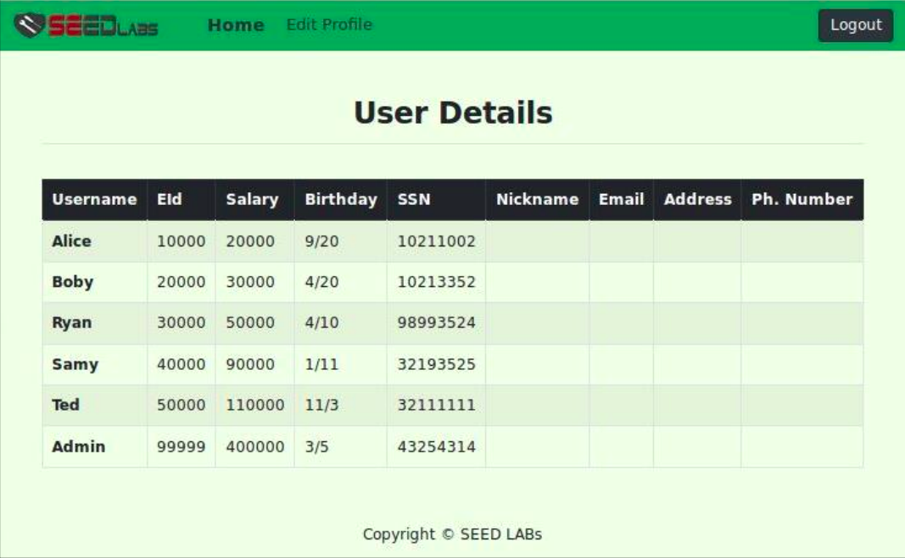
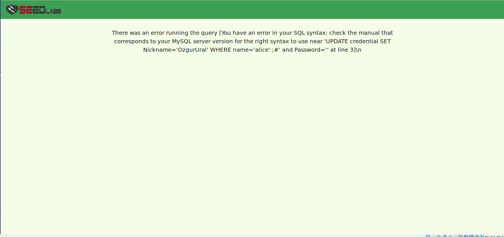
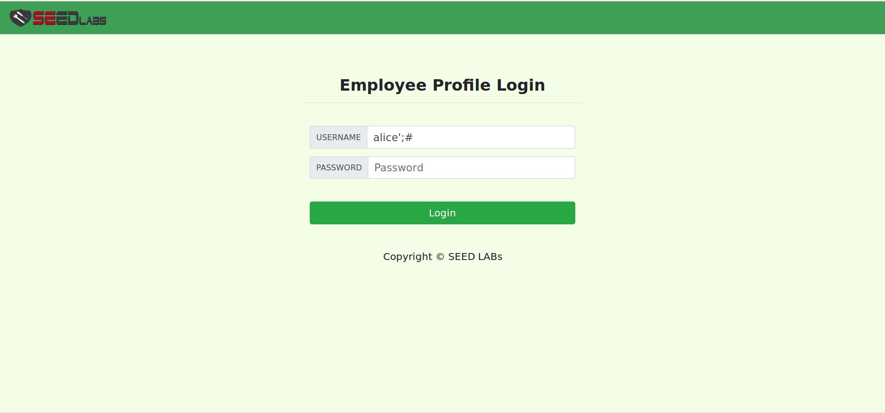
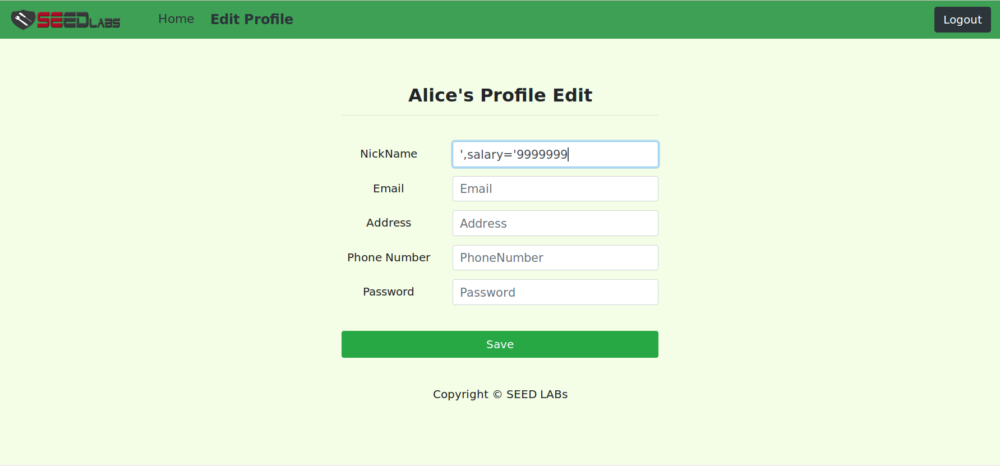
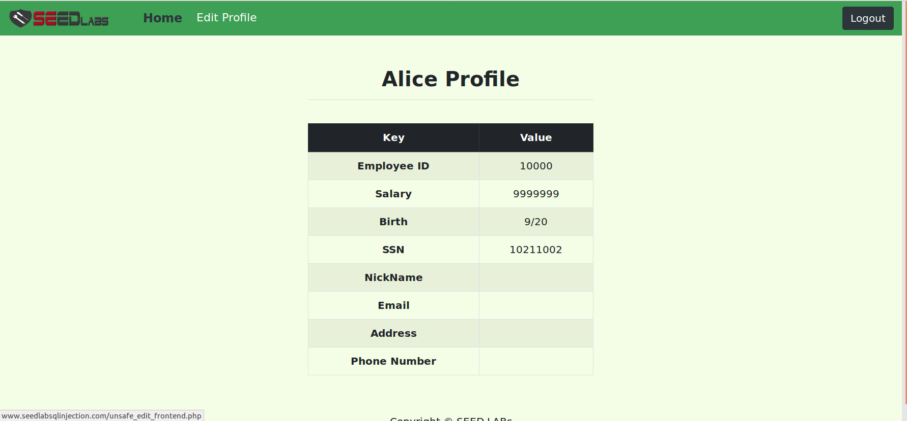
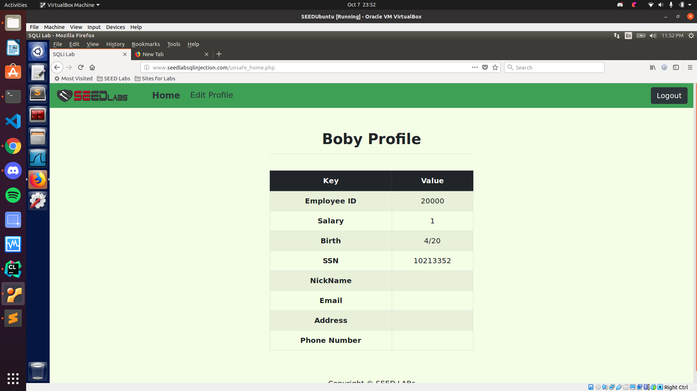

# SEEDlabs: SQL Injection Attack Lab

#### Ozgur Ural
#### Student ID: 2564455

## 1 Lab Description

SQL injection is a code injection technique that exploits the vulnerabilities in the interface between web applications and database servers. The vulnerability is present when user’s inputs are not correctly checked within the web applications before sending to the back-end database servers.Many web applications take inputs from users, and then use these inputs to construct SQL queries, so the web applications can pull the information out of the database. Web applications also use SQL queries to store information in the database. These are common practices in the development of web applications. When the SQL queries are not carefully constructed, SQL-injection vulnerabilities can occur. SQL-injection attacks is one of the most frequent attacks on web applications.In this lab, we modified a web application called Collabtive, and disabled several countermeasures implemented by Collabtive. As the results, we created a version of Collabtive that is vulnerable to the SQL-Injection attack. Although our modifications are artificial, they capture the common mistakes made  by  many  web  developers.  Students’  goal  in  this  lab  is  to  find  ways  to  exploit  the  SQL-Injection vulnerabilities, demonstrate the damage that can be achieved by the attacks, and master the techniques that can help defend against such attacks.

##  2 Lab Environment

## 2.1 Environment Configuration
We have developed a web application for this lab. The folder where the application is installed and the URL to access this web application are described in the following:
•URL:http://www.SEEDLabSQLInjection.com
•Folder: /var/www/SQLInjection/

The above URL is is only accessible from inside of the virtual machine, because we have modified the/etc/hosts file to map the domain name of each URL to the virtual machine’s local IP address (127.0.0.1). You  may  map  any  domain  name  to  a  particular  IP  address  using  /etc/hosts.  For  example,  you  can  map http://www.example.com to the local IP address by appending the following entry to /etc/hosts:

127.0.0.1 www.example.com

If your web server and browser are running on two different machines, you need to modify /etc/hosts on the browser’s machine accordingly to map these domain names to the web server’s IP address, not to 127.0.0.1.

## 3 Lab Tasks
We have created a web application, and host it at www.SEEDLabSQLInjection.com. This web application is a simple employee management application. Employees can view and update their personal information in the database through this web application. There are mainly two roles in this web application: Administrator is a privilege role and can manage each individual employees’ profile information; Employee is a normal role and can view or update his/her own profile information. All employee information is described in the following table.

## 3.1 Task 1: SQL Injection Attack on SELECT Statements
### Task 1.1: SQL Injection Attack from webpage. 
In this task, we need to login into the admin page without knowing any employee’s credential. Figure 1 shows
login to the SQL injection webpage.

Figure 1 

After having logged into the SQL Injection webpage, we can see the details as shown in Figure 2.

Figure 2 

### Task 1.2: Append a new SQL statement. 
n the above task, we can only steal information from the database; it will be better if we can modify the database using the same vulnerability in the login page. An idea is to use the SQL injection attack to turn one SQL statement into two, with the second one being the update or delete statement. In SQL, semicolon (;) is used to separate two SQL statements. Please describe how you can use the login page to get the server run two SQL statements. Try the attack to delete a record from the database, and describe your observation.

In this task, you first need to show how you tried to perform such an attack. (To be honest, we are unable to achieve the update goal. This is because of a particular defense mechanism implemented in MySQL.) Then, you need to find out from the Internet why the attack fails, what mechanism in MySQL has prevented such an attack. (Hint: this is something related to the mysql query function in the class.user.php code)

I tried the following SQL query to update the statement:

alice'; UPDATE credential SET Nickname='OzgurUral' WHERE name='alice' ;#

However it did not succeed and returned the page shown below:

Figure 3 

Because the protection mechanism of MySql database does not allow multiple statements to be executed, so the injection fails.


## 3.2 Task 2: SQL Injection Attack on UPDATE Statements
### Task 2.1: Modify your own salary
Firstly, I entered the system as Alice with the command below.

Figure 4

Then, I modify Alice's salary with the command below:

Figure 5

And as you can see in Figure 6, Alice's salary is increased.

Figure 6

Also, af as you can see in Figure 7, Boby's salary is set as 1 dollar. This time we firstly entered the System as Boby and change the salary with the same method explained previously.

Figure 7

### Task 2.1: Modify other people’s password.

```sh
[10/08/21]seed@VM:~$ echo -n PasswordOzgurural > password.txt
[10/08/21]seed@VM:~$ cat password.txt
PasswordOzgurural[10/08/21]seed@VM:~$ 
[10/08/21]seed@VM:~$ sha1sum password.txt
2303012284ca4c22d18b3ac808bfcec68598a020  password.txt
[10/08/21]seed@VM:~$ 
```
Then I enter:

‘, Password=’2303012284ca4c22d18b3ac808bfcec68598a020′ WHERE Name=’Boby’;#

Into the NickName field on Alice’s Edit Profile page.
After I submit it, I log out of Alice’s account and try to log into Boby’s account with the new password (PasswordOzgurural):

Figure 8

