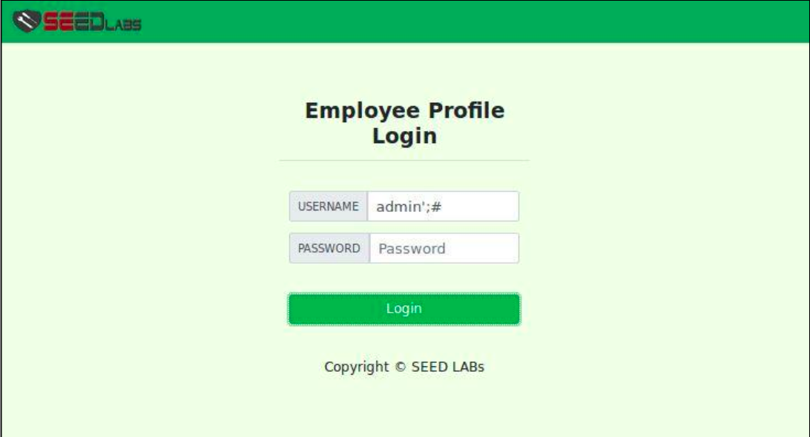

# SEEDlabs: SQL Injection Attack Lab

#### Ozgur Ural
#### Student ID: 2564455

## 1 Lab Description

SQL injection is a code injection technique that exploits the vulnerabilities in the interface between web applications and database servers. The vulnerability is present when user’s inputs are not correctly checked within the web applications before sending to the back-end database servers.Many web applications take inputs from users, and then use these inputs to construct SQL queries, so the web applications can pull the information out of the database. Web applications also use SQL queries to store information in the database. These are common practices in the development of web applications. When the SQL queries are not carefully constructed, SQL-injection vulnerabilities can occur. SQL-injection attacks is one of the most frequent attacks on web applications.In this lab, we modified a web application called Collabtive, and disabled several countermeasures implemented by Collabtive. As the results, we created a version of Collabtive that is vulnerable to the SQL-Injection attack. Although our modifications are artificial, they capture the common mistakes made  by  many  web  developers.  Students’  goal  in  this  lab  is  to  find  ways  to  exploit  the  SQL-Injection vulnerabilities, demonstrate the damage that can be achieved by the attacks, and master the techniques that can help defend against such attacks.

##  2 Lab Environment

## 2.1 Environment Configuration
We have developed a web application for this lab. The folder where the application is installed and the URL to access this web application are described in the following:
•URL:http://www.SEEDLabSQLInjection.com
•Folder: /var/www/SQLInjection/

The above URL is is only accessible from inside of the virtual machine, because we have modified the/etc/hosts file to map the domain name of each URL to the virtual machine’s local IP address (127.0.0.1). You  may  map  any  domain  name  to  a  particular  IP  address  using  /etc/hosts.  For  example,  you  can  map http://www.example.com to the local IP address by appending the following entry to /etc/hosts:

127.0.0.1 www.example.com

If your web server and browser are running on two different machines, you need to modify /etc/hosts on the browser’s machine accordingly to map these domain names to the web server’s IP address, not to 127.0.0.1.

## 3 Lab Tasks
We have created a web application, and host it at www.SEEDLabSQLInjection.com. This web application is a simple employee management application. Employees can view and update their personal information in the database through this web application. There are mainly two roles in this web application: Administrator is a privilege role and can manage each individual employees’ profile information; Employee is a normal role and can view or update his/her own profile information. All employee information is described in the following table.

## 3.1 Task 1: SQL Injection Attack on SELECT Statements
### Task 1.1: SQL Injection Attack from webpage. 
In this task, we need to login into the admin page without knowing any employee’s credential. Figure 1 shows
login to the SQL injection webpage.

After having logged into the SQL Injection webpage, we can see the details as shown in Figure 6.
