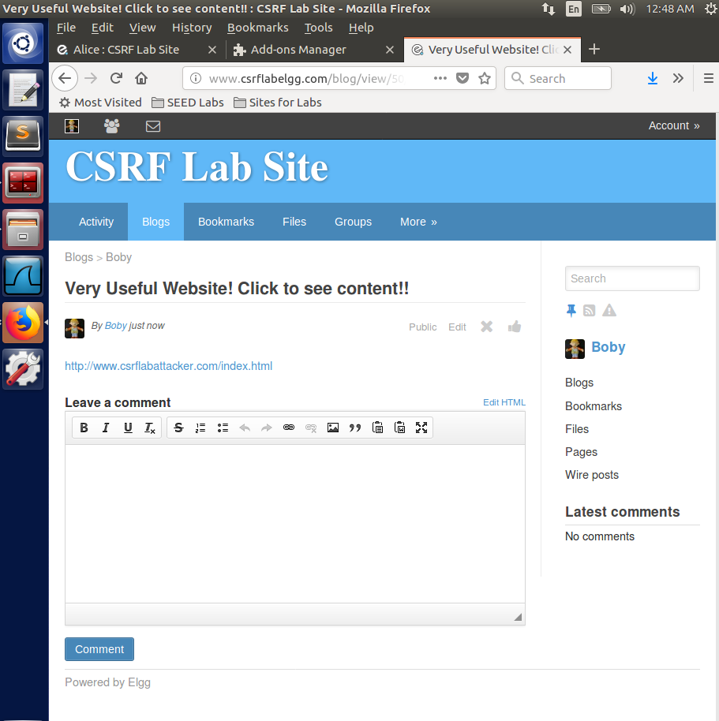

# SEEDlabs: Cross-Site Request Forgery (CSRF) Attack Lab

#### Ozgur Ural
#### Student ID: 2564455

## 1 Lab Description

The objective of this lab is to help students understand the Cross-Site Request Forgery (CSRF)  attack.  A  CSRF  attack  involves  a  victim  user,  a  trusted  site,  and  a  malicious  site.  The  victim user holds an active session with a trusted site while visiting a malicious site. The malicious site injects an HTTP request for the trusted site into the victim user session, causing damages.

In  this  lab,  students  will  be  attacking  a  social  networking  web  application  using  the  CSRF attack. The open-source social networking application called Elgg has countermeasures against CSRF, but we have turned them off for the purpose of this lab.

## 2 Lab Environment
You need to use our provided virtual machine image for this lab.
##  2.1 Environment Configuration
In  this  lab,  we  need  three  things,  which  are  already  installed  in  the  provided  VM  image:  (1)  the  Firefox  web browser,  (2)  the  Apache  web  server,  and  (3)  the  Elgg  web  application.  For  the  browser,  we  need  to  use  the LiveHTTPHeaders extension for Firefox to inspect the HTTP requests and responses. The prebuilt Ubuntu VM image provided to you has already installed the Firefox web browser with the required extensions. Starting the Apache  Server. The  Apache web server is also included in the  prebuilt Ubuntu image. However, the web server is not started by default. You need to first start the web server 
using the following command:

```sh
% sudo service apache2 start
```

The Elgg Web Application. We use an open-source web application called Elgg in this lab. Elgg is a web-based social-networking application. It is already set up in the pre-built Ubuntu VM image. We have also created several user accounts on the Elgg server and the credentials are given below
User UserName Password
Admin admin seedelgg
Alice alice seedalice
Boby boby seedboby
Charlie charlie seedcharlie
Samy samy seedsamy
Configuring DNS. We have configured the following URLs needed for this lab. To access the URLs, the Apache server needs to be started first:

URL                            
http://www.csrflabattacker.com
http://www.csrflabelgg.com 

Description         
Attacker web site 
Elgg web site 

Directory
/var/www/CSRF/Attacker/
/var/www/CSRF/Elgg/

## 3 Background of CSRF Attacks
A CSRF attack involves three actors: a trusted site (Elgg), a victim user of the trusted site, and a malicious  site.  The  victim  user  simultaneously  visits  the  malicious  site  while  holding  an  active session with the trusted site. The attack involves the following sequence of steps:
1. The victim user logs into the trusted site using his/her username and password, and thus 
creates a new session.
2. The trusted site stores the session identifier for the session in a cookie in the victim user’s web browser.
3. The victim user visits a malicious site.
4. The  malicious  site’s  web  page  sends  a  request  to  the  trusted  site  from  the  victim  user’s 
browser. This request is a cross-site request, because the site from where the request is 
initiated is different from the site where the request goes to.
5. By design, web browsers automatically attach the session cookie to to the request, even if 
it is a cross-site request.
6. The trusted site, if vulnerable to CSRF, may process the malicious request forged by the attacker web 
site, because it does not know whether the request is a forged cross-site request or a legitimate one.
The malicious site can forge both HTTP GET request for the trusted site. Some HTML tags 
such as img, iframe, frame, and form have no restrictions on the URL that can be used in their 
attribute. HTML img, iframe, and frame can be used for forging GET requests.
## 4 Lab Tasks
For  the  lab  tasks,  you  will  use  two  web  sites  that  are  locally  setup  in  the  virtual  machine.  The 
first  web  site  is  the  vulnerable  Elgg  site  accessible  at  www.csrflabelgg.com  inside  the  virtual 
machine.  The  second  web  site  is  the  attacker’s  malicious  web  site  that  is  used  for  attacking 
Elgg. This web site is accessible via www.csrflabattacker.com inside the virtual machine.

## 4.1 Task: CSRF Attack using GET Request
In  this  task,  we  need  two  people  in  the  Elgg  social  network:  Alice  and  Boby.  Boby  wants  to  become  a 
friend to Alice, but Alice refuses to add Boby to her Elgg friend list. Boby decides to use the CSRF attack 
to  achieve  his  goal.  He  sends  Alice  an  URL  (via  an  email  or  a  posting  in  Elgg);  Alice,  curious  about  it, 
clicks  on  the  URL,  which  leads  her  to  Boby’s  web  site:  www.csrflabattacker.com.  Pretend  that  you  are 
Boby,  describe  how  you  can  construct  the  content  of  the  web  page,  so  as  soon  as  Alice  visits  the  web 
page, Boby is added to the friend list of Alice (assuming Alice has an active session with Elgg).
To  add  a  friend  to  the  victim,  we  need  to  identify  the  Add  Friend  HTTP  request,  which  is  a  GET 
request. In this task, you are not allowed to write JavaScript code to launch the CSRF attack. Your job is 
to make the attack successful as soon as Alice visits the web page, without even making any click on the 
page (hint: you can use the img tag, which automatically triggers an HTTP GET request).


Figure 1 


Figure 2 


Figure 3


Figure 4 


Figure 5 


Figure 6 


Figure 7 


Figure 8 


Figure 9 


Figure 10 


Figure 11 


##  4.2 Task: Turn on countermeasure
To turn on the countermeasure, please go to the directory elgg/engine/lib and find the function 
action gatekeeper in the actions.php file. In function action gatekeeper please comment out the 
"return true;" statement as specified in the code comments.
```sh
function action_gatekeeper($action) {
//SEED:Modified to enable CSRF.
//Comment the below return true statement to enable countermeasure return true;
........
........
}
```
After turning on the countermeasure above, try the CSRF attack again, and describe your 
observation.  Please  point  out  the  secret  tokens  in  the  HTTP  request  captured  using  LiveHTTPHeaders. 
Please explain why the attacker cannot send these secret tokens in the CSRF attack?
