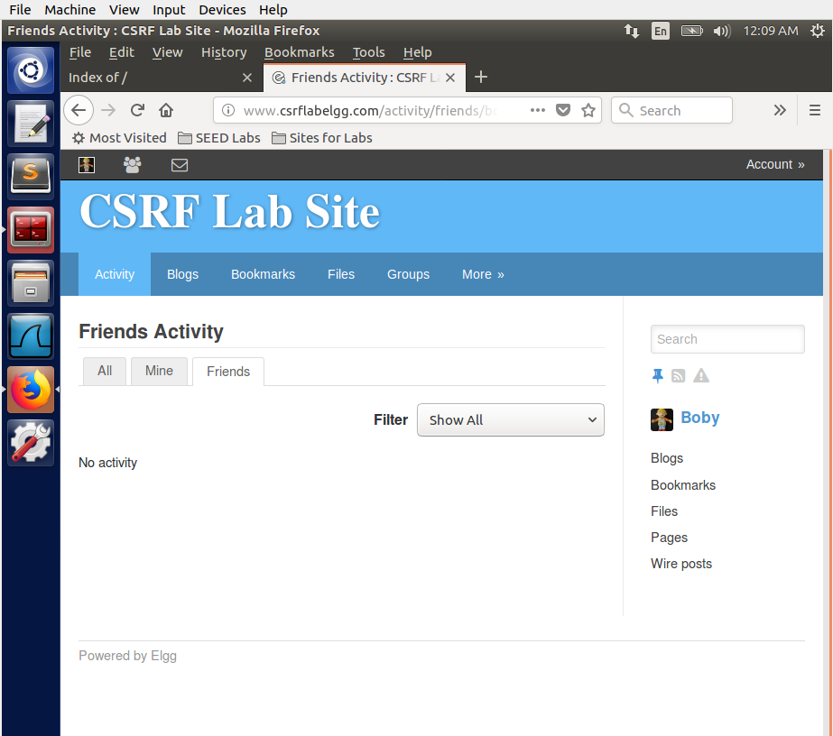
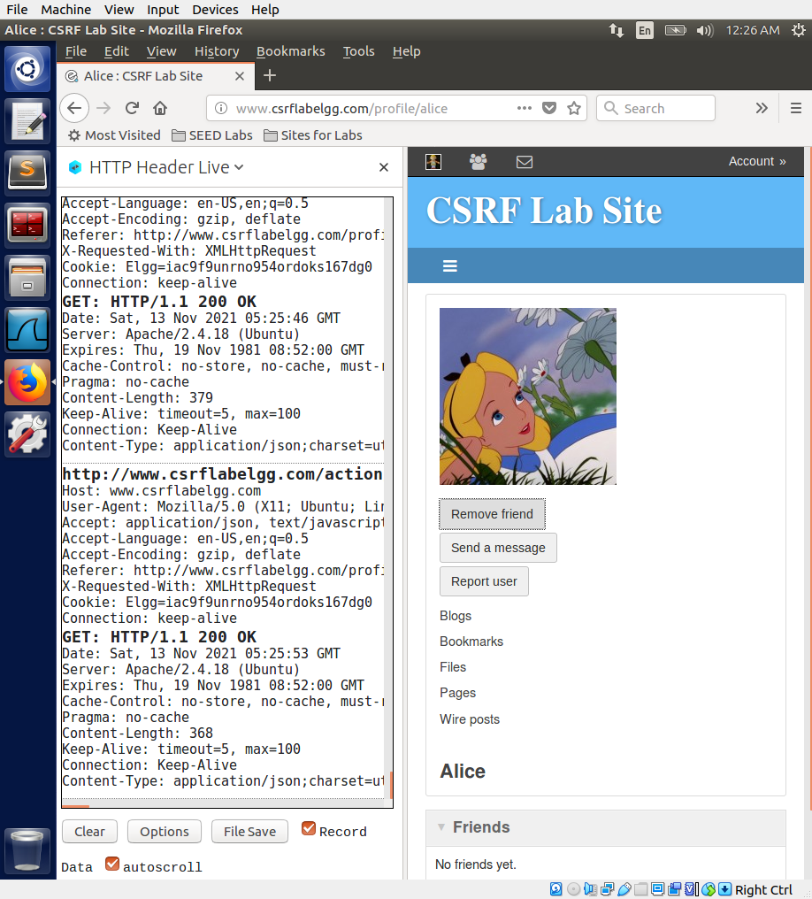
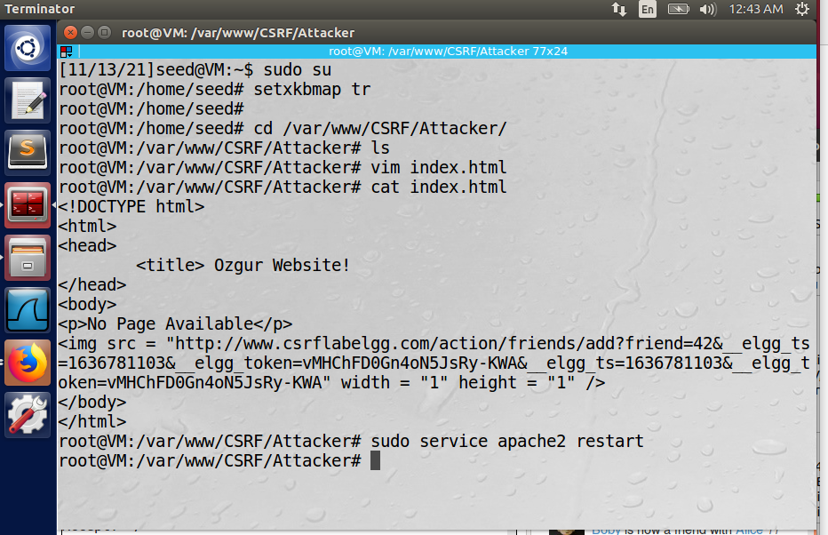
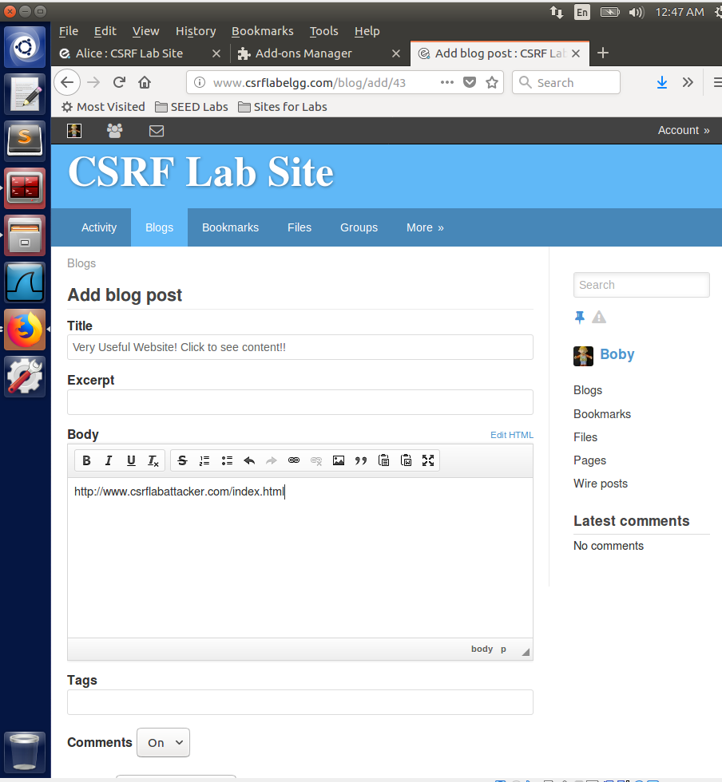
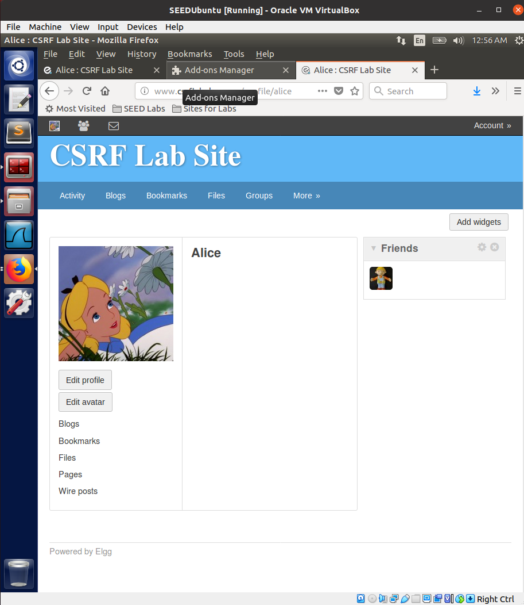

# SEEDlabs: Dirty COW Attack Lab

#### Ozgur Ural
#### Student ID: 2564455

## 1 Lab Overview

The Dirty COW vulnerability is an interesting case of the race condition vulnerability. It existed in the  Linux  kernel  since  September  2007,  and  was  discovered  and  exploited  in  October  2016. The vulnerability affects all Linux-based operating systems, including Android, and its consequence is very severe: attackers can gain the root privilege by exploiting the vulnerability. The  vulnerability  resides  in  the  code  of  copy-on-write  inside  Linux  kernel.  By  exploiting  this vulnerability, attackers can modify any protected file, even though these files are only readable to them.

The objective of this lab is for you to gain the hands-on experience on the Dirty COW attack, understand the race condition vulnerability exploited by the attack, and gain a deeper understanding  of  the  general race condition security  problems.  In  this  lab, you will  exploit the Dirty COW race condition vulnerability to gain the root privilege. Note:  This  lab  is  based  on  the  Ubuntu12.04  VM.  If  you  are  currently  using  a  newer  Linux version,  such  as  Ubuntu16.04,  the  vulnerability  has  already  been  patched.  Therefore, to complete this lab please use the Ubuntu 12.04 VM.

## 2 Task 1: Modify a Dummy Read-Only File
The objective of this task is to write to a read-only file using the Dirty COW vulnerability.

## 2.1 Create a Dummy File
We first need to select a target file. Although this file can be any read-only file in the system, we will use a dummy file in this task, so we do not corrupt an important system file in case we make a mistake. Please create a file called zzz in the root directory using the root account, change its permission  to  read-only for normal users, and put some random content into the file using an editor such as gedit.

```sh
$ sudo touch /zzz
$ sudo chmod 644 /zzz
$ sudo gedit /zzz
$ cat /zzz 111111222222333333
$ ls -l /zzz
$ -rw-r--r-- 1 root root 19 Oct 18 22:03 /zzz
$ echo 99999 > /zzz
$ bash: /zzz: (*@Permission denied@*)
```

From the above experiment, we can see that if we try to write to this file as a normal user, we will fail, because the file is only readable to normal users. However, because of the Dirty COW vulnerability in the system, we can find a way to write to this file. Our objective is to replace the pattern "222222" with "******".

## 2.2 Set Up the Memory Mapping Thread

You  check  the  program  cow  attack.c  for  this  lab.  The  program  has  three  threads:  the  main 
thread, the write thread, and the madvise thread. The main thread maps /zzz to memory, finds 
where  the  pattern  "222222"  is,  and  then  creates  two  threads  to  exploit  the  Dirty  COW  race 
condition vulnerability in the OS kernel.
```sh
/* cow_attack.c (the main thread) */
#include <stdio.h>
#include <sys/mman.h>
#include <fcntl.h>
#include <pthread.h>
#include <unistd.h>
#include <sys/stat.h>
#include <string.h>
#include <stdint.h>
#define OFFSET 5
#define TARGET_CONTENT " I have successfully Attacked!! "
void *map;
int main(int argc, char *argv[])
{
pthread_t pth1,pth2;
struct stat st;
// Open the file in read only mode. int 
f=open("/zzz", O_RDONLY);
// Open with PROT_READ.
fstat(f, &st);
map=mmap(NULL, st.st_size, PROT_READ, MAP_PRIVATE, f, 0);
// We have to do the attack using two threads.
pthread_create(&pth1, NULL, madviseThread, NULL); (*@Line 1@*)
pthread_create(&pth2, NULL, writeThread, TARGET_CONTENT); (*@Line 2@*)
// Wait for the threads to finish. 
pthread_join(pth1, NULL); 
pthread_join(pth2, NULL);
return 0;
}
```
In the above code, we start two threads: madviseThread (Line À) and writeThread (Line `)


## 3 Background of CSRF Attacks
A CSRF attack involves three actors: a trusted site (Elgg), a victim user of the trusted site, and a malicious  site.  The  victim  user  simultaneously  visits  the  malicious  site  while  holding  an  active session with the trusted site. The attack involves the following sequence of steps:
1. The victim user logs into the trusted site using his/her username and password, and thus 
creates a new session.
2. The trusted site stores the session identifier for the session in a cookie in the victim user’s web browser.
3. The victim user visits a malicious site.
4. The  malicious  site’s  web  page  sends  a  request  to  the  trusted  site  from  the  victim  user’s 
browser. This request is a cross-site request, because the site from where the request is 
initiated is different from the site where the request goes to.
5. By design, web browsers automatically attach the session cookie to to the request, even if 
it is a cross-site request.
6. The trusted site, if vulnerable to CSRF, may process the malicious request forged by the attacker web 
site, because it does not know whether the request is a forged cross-site request or a legitimate one.
The malicious site can forge both HTTP GET request for the trusted site. Some HTML tags 
such as img, iframe, frame, and form have no restrictions on the URL that can be used in their 
attribute. HTML img, iframe, and frame can be used for forging GET requests.
## 4 Lab Tasks
For  the  lab  tasks,  you  will  use  two  web  sites  that  are  locally  setup  in  the  virtual  machine.  The 
first  web  site  is  the  vulnerable  Elgg  site  accessible  at  www.csrflabelgg.com  inside  the  virtual 
machine.  The  second  web  site  is  the  attacker’s  malicious  web  site  that  is  used  for  attacking 
Elgg. This web site is accessible via www.csrflabattacker.com inside the virtual machine.

## 4.1 Task: CSRF Attack using GET Request
In  this  task,  we  need  two  people  in  the  Elgg  social  network:  Alice  and  Boby.  Boby  wants  to  become  a 
friend to Alice, but Alice refuses to add Boby to her Elgg friend list. Boby decides to use the CSRF attack 
to  achieve  his  goal.  He  sends  Alice  an  URL  (via  an  email  or  a  posting  in  Elgg);  Alice,  curious  about  it, 
clicks  on  the  URL,  which  leads  her  to  Boby’s  web  site:  www.csrflabattacker.com.  Pretend  that  you  are 
Boby,  describe  how  you  can  construct  the  content  of  the  web  page,  so  as  soon  as  Alice  visits  the  web 
page, Boby is added to the friend list of Alice (assuming Alice has an active session with Elgg).
To  add  a  friend  to  the  victim,  we  need  to  identify  the  Add  Friend  HTTP  request,  which  is  a  GET 
request. In this task, you are not allowed to write JavaScript code to launch the CSRF attack. Your job is 
to make the attack successful as soon as Alice visits the web page, without even making any click on the 
page (hint: you can use the img tag, which automatically triggers an HTTP GET request).


Figure 1 

First of all, we need to know Boby's user id. We inspected the element on Boby to find the id. As you can see, it is 43.



Figure 2 

We then login with Boby's account and see that Boby has no friends in his friends list. 


Figure 3

Then, we search Alice as you can see Figure 3. 


Figure 4 

After that, we add the Alice and simultaneously check the "HTTP Header Live" extension to find the GET request for XMLHTTPRequest.



Figure 5 

Then, we copt the URL fronm the GET request and the URL has elgg_ts and elgg_token in it which we use to append in our URL string wike creating a malicious site. Instead of Alice's user id, we give Boby's user id(43).


Figure 6 

As you can see in Figure 6, we created an index.html file under the /var/www/CSRF/Attacker folder. 



Figure 7 

After that we restart the Apache service. 



Figure 8 

After creating the malicious site, we login as Boby and create a blog post for phising attack. The blog post contains a malicious URL and we think Alice will click it. 


Figure 9 


Figure 10 

After that, we login the website as ALice and see the blog post created by Boby.


Figure 11 

Lastly, we click in the Boby's blog post. As you can see in Figure 11, Alice added Bob as a friend unconsciously with that malicious link. In this example attack, a malicious URL injected through trusted website using GET request.


##  4.2 Task: Turn on countermeasure
To turn on the countermeasure, please go to the directory elgg/engine/lib and find the function 
action gatekeeper in the actions.php file. In function action gatekeeper please comment out the 
"return true;" statement as specified in the code comments.
```sh
function action_gatekeeper($action) {
//SEED:Modified to enable CSRF.
//Comment the below return true statement to enable countermeasure return true;
........
........
}
```
After turning on the countermeasure above, try the CSRF attack again, and describe your observation.  Please  point  out  the  secret  tokens  in  the  HTTP  request  captured  using  LiveHTTPHeaders. Please explain why the attacker cannot send these secret tokens in the CSRF attack?

After turning on the countermeasure above, we login again to Alice's account and click the malicious url again. This time she sees a warning about the attack. Since Alice had a different timestamp(elgg_ts) and different unique secret token(elgg_token), the attack could not succeed. Whenever there is a request, it checks if the two secret values are valid for the current active session. 


